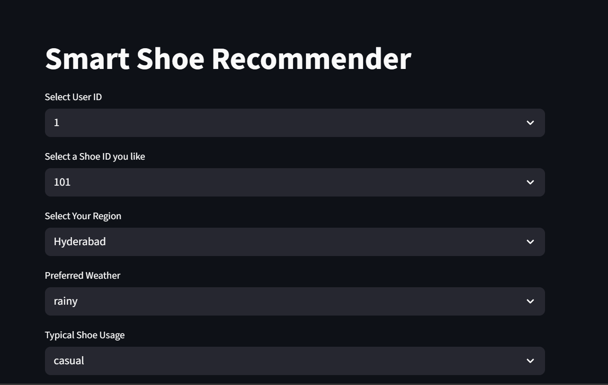
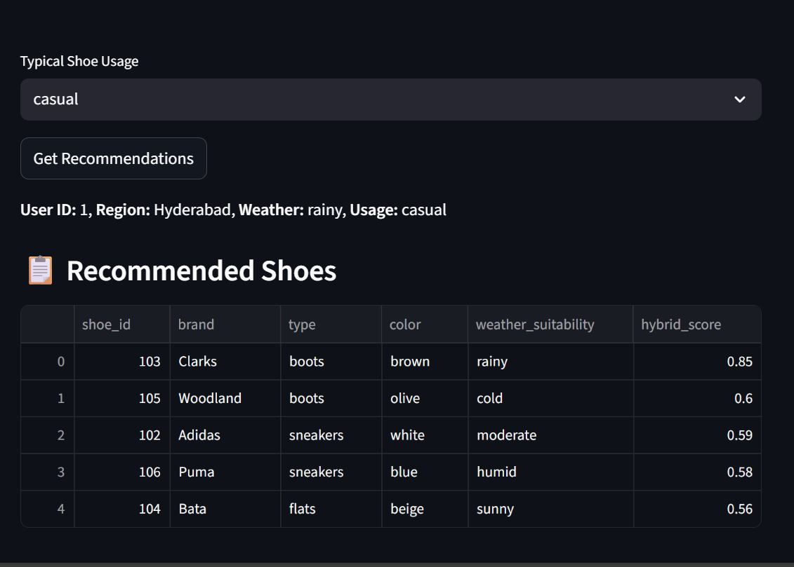

# Shoe Recommendation System & Personalized Services

## Project Overview
This project is a **hybrid shoe recommendation system** with **personalized services** that I built for the AnalogDots assessment .
It's designed for smart shoe retail and connected shoe-care devices. 

The system uses **Content-Based Filtering** and **Collaborative Filtering (profile-based)**, and also considers **weather suitability, user profiles, and interaction history** to make better suggestions.  

Apart from recommendations, I’ve also designed logic for three **personalized proactive services** like:
1. **Proactive Shoe Care Reminder**
2. **Replacement Recommendations**
3. **Travel Destination & Weather-based Shoe Suggestions**

The project is implemented in Python using pandas, scikit-learn, and Streamlit. I also designed a **PostgreSQL database schema** so the system can scale for real-world use.

---------------------------------------------------------------------
##  Why I Chose a Hybrid Recommendation Approach?
When I tested both methods separately, I saw pros and cons:
### 1. Content-Based Filtering  
-  Works well by comparing shoe attributes like (`brand`, `type`, `color`, `material`, `care_level`, `weather_suitability`, `size`).  
- Good for new users because it doesn’t need their history.

### 2. Collaborative Filtering (Profile-based)  
- Looks at **user profile attributes** (`preferred_weather`, `typical_usage`) and **past interactions** (`view`, `wishlist`, `purchase`) to find patterns.  
- Leverages user history and preferences for personalization.
- Gives personalized results if the user has enough activity.

### 3. Hybrid Model
**Why Combine Them (60% content + 40% collaborative)** Merges both methods, applying **weighted scoring**:
  - 60% weight to **content similarity**
  - 40% weight to **user profile-based collaborative score**
  - Every shoe has detailed attributes (brand, type, material, weather_suitability), so content-based matching is highly reliable even for users with fewer interactions. 
  - Content-based alone ignores collaborative trends.

  - Collaborative can capture personal patterns but is weak for new users or new shoes.

  - I gave content-based more weight (60%) because, in my testing, it produced accurate results even for users with little activity, while collaborative worked better as a complement.
  - If a user is new or interaction history is limited, collaborative scoring would be weak, but content similarity can still suggest close matches instantly.
  - Hybrid leverages **both strengths**.

So, Merged both methods, applying **weighted scoring**:
  - 60% weight to **content similarity**
  - 40% weight to **user profile-based collaborative score**

-----------------------------------------------------------------------------

## Personalized Service Logic
The file `personalized_services_logic.txt` contains detailed pseudocode for **three features**:

### 1. Proactive Shoe Care Reminder
- If a user frequently uses leather shoes or boots within a time period, send a care reminder.

### 2. Replacement Recommendation
- If a shoe was purchased more than 6 months ago but the user is still interacting with it often, suggest a newer model.

### 3. Travel + Weather Trend Shoe Suggestions
-  If a user’s region trends show more travel to a certain climate (e.g., cold places in winter), suggest shoes suited for that climate based on their usage type.
(e.g., boots for cold destinations).

-------------------------------------------------------------------------------

##  Dataset Description
I Used **synthetic datasets** for testing. These simulate realistic situations. 

### 1. `shoes.csv`
- shoe catalog with attributes (brand, model, type, material, color, size, care level, weather suitability)

### 2. `users.csv`
- user profiles with age, gender, usage type, preferred weather, and region

### 3. `interactions.csv`
-  history of user actions (view, wishlist, purchase) with dates
-----------------------------------------------------------------------------

##  Database Schema Design (PostgreSQL)
The file `schema.sql` contains 5 tables:

1. **users** – Stores profiles & preferences.
2. **shoes** – Shoe catalog data.
3. **interactions** – History of actions.
4. **shoe_care_logs** – Device-based care history (future integration).
5. **recommendation_logs** – Stores recommendations for analysis.

#### I designed it to be **scalable**, maintain **data integrity** with foreign keys, and support fast lookups for recommendations and personalized services.

-------------------------------------------------------------------------------

## System Flow
1. **User interacts** with shoes → stored in `interactions.csv` / DB.
2. **Content-Based Model** calculates similarity from shoe attributes.
3. **Collaborative Model** scores based on profile & history.
4. **Hybrid Engine** merges results with weighted scoring.
5. **Personalized services** run in background based on usage patterns.
6. **Streamlit Dashboard** [optional] : lets you test recommendations dynamically.

---------------------------------------------

## Streamlit Dashboard Preview

*Home page with dynamic filters for region, weather, and usage type.*

*Hybrid recommendation results displayed interactively.*

## Setup & Run Instructions
### 1. Clone the repository
git clone <repo-url>
cd AnalogDots

### 2. Create & Activate Virtual Environment
python3.11 -m venv venv311
- Windows
venv311\Scripts\activate
- Linux/Mac
source venv311/bin/activate

### 3. Install dependencies
pip install -r requirements.txt

### 4.Run individual modules
python Recommendation_System/content_based.py
python Recommendation_System/collaborative_simulated.py
python Recommendation_System/hybrid.py

### 5.Launch Streamlit dashboard
streamlit run recommendation_dashboard.py

## Project Structure
.
├── data/
│   ├── shoes.csv
│   ├── users.csv
│   ├── interactions.csv
├── Recommendation_System/
│   ├── content_based.py
│   ├── collaborative_simulated.py
│   ├── hybrid.py
├── personalized_services_logic.txt
├── schema.sql
├── requirements.txt
├── recommendation_dashboard.py     # Optional Streamlit UI
├── README.md

.
├── data/
│   ├── shoes.csv
│   ├── users.csv
│   ├── interactions.csv
├── Recommendation_System/
│   ├── content_based.py
│   ├── collaborative_simulated.py
│   ├── hybrid.py
├── media/
│   ├── recommendations_output.png
│   ├── dashboard_home.png
├── personalized_services_logic.txt
├── schema.sql
├── requirements.txt
├── recommendation_dashboard.py     # Optional Streamlit UI
├── README.md
